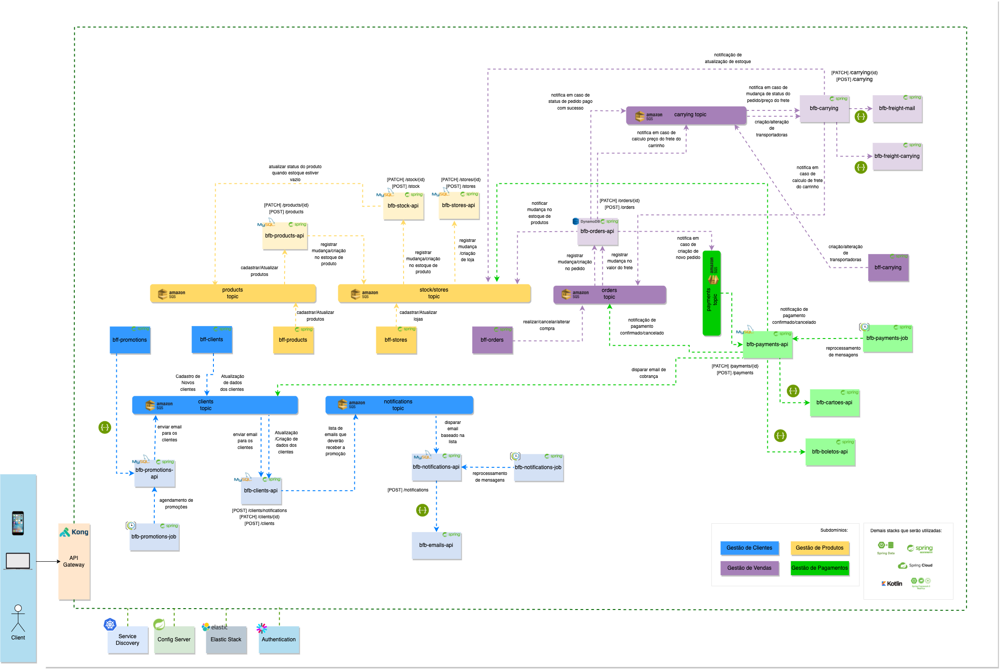

<h1 align="center">Desafio Aula de Microsserviços</h1>

 <i>Sobre o desafio: </i>
  Esse desafio tem como objetivos decompor um monolito e definir a nova arquitetura utilizando os conceitos aprendidos durante as aulas. Cenário: Temos um monolito que atualmente tem diversas responsabilidades e você é encarregada de dividir ele da melhor forma possível e definir quais tecnologias serão 
utilizadas (quais projetos Spring, forma de comunicação, etc)
 

<h4>Cenário do monolito atual:</h4>
<ul>

<li>Cadastro de novos clientes pessoa física</li>
<li>Cadastro de novos clientes pessoas jurídicas</li>
<li>Atualização de dados cadastrais de ambos</li>
<li>Envio de e-mails com promoções para todos os clientes pessoa física</li>
<li>Cadastrar produtos disponíveis em cada loja cadastrada</li>
<li>gerenciar quantidades de produtos disponíveis para estoque</li>
<li>Atualização de produtos disponíveis em estoque a cada compra realizada</li>
<li>Recebimento de solicitações de compra que serão pagas com boleto</li>
<li>Recebimento de solicitações de compra que serão pagas com cartão de crédito</li>
<li>Encaminhar o valor do pagamento as lojas</li>
<li>Efetuar cobranças de pessoas compradoras</li>
<li>Após confirmação de pagamento enviar notificação ao setor de estoque </li>
<li>Calcular valor de frete via correios para cada cep</li>
<li>Calcular valor de frete via transportadora para cada cep</li>
<li>Adicionar valor de frete no carrinho</li>
<li>Comunicar o estoque quando enviar os produtos via correios e transportadora</li>
</ul>

<h4>Desenho da arquitetura Cenário do monolito atual </h4>

(in progress)

 

<h4>Cenário de microsserviços proposto:</h4>
<ul>

<li>fazer uma divisão dos microsserviços por subdomínio, e identifiquei os quatro seguintes: Compras, Vendas, Produtos e Pagamentos</li>

<li>criar microsserviços bff que servirão de acesso aos tópicos correspondentes do fluxo.</li>

<li>utilizar uma arquitetura assíncrona com recursos de tópicos e consumers, através dos recursos da AWS - SQS.</li>

<li>Para alguns serviços de borda não bloqueantes, utilizei o recurso de requisições síncronas.</li>

<li>Disponibilização de Jobs para reprocessamento em caso de falhas.</li>

<li>Criação de bancos de dados isolados para cada microsserviço (SQL ou NoSQL).</li>

<li>Garantir acesso as apis por intermédio de um API-Gateway.</li>

<li>Utilizar os recursos de autenticação JWT para acesso as apis.</li>

<li>Garantir a persistência e gerenciamento das configurações via ConfigServer e a interoperabilidade do Service Discovery via Kubernets.</li>

<li>Permitir que consigamos ter a capacidade de observabilidade de todas as aplicações via ElasticStack.</li>

</ul>

<h4>Desenho da arquitetura Cenário de Solução Proposto:</h4>
 

<h1 align="center">
    
</h1>

Tecnologias sugeridas:

- [SpringFramework](https://spring.io/)
- [mySQL](https://www.mysql.com/)
- [DynamoDB](https://aws.amazon.com/pt/dynamodb/)
- [SQS](https://aws.amazon.com/pt/sqs/)
- [Kotlin](https://kotlinlang.org/)
- [SpringData](https://spring.io/projects/spring-data)
- [SpringCloud](https://spring.io/projects/spring-cloud)
- [SpringSecurity](https://spring.io/projects/spring-security)
- [Kong](https://konghq.com/kong/)
- [Kubernets](https://cloud.google.com/kubernetes-applications)
- [Elastic](https://www.elastic.co/pt/)
